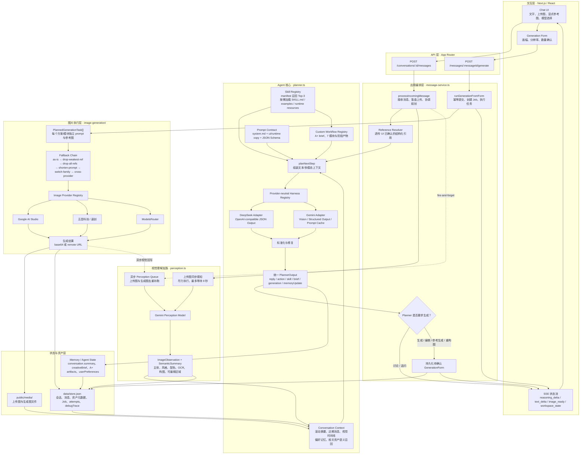
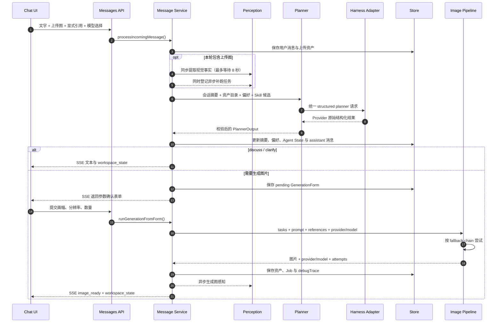

# BrainX-AI-Image-Agent-SuperXiaoWei

一个以聊天为中心的图像创作 harness。

当前仓库包含：

- Next.js + TypeScript 图像创作工作台
- 服务端 harness：planner、skills、上下文记忆、参考图解析与生图编排
- Google AI Studio、五音科技 / 速创 API 与 ModelsRouter 图片 provider

## Agent 详细架构

Agent 采用“交互入口 → 消息编排 → Planner → 参数确认 → 图片生成”的两阶段结构。Planner 只决定本轮意图、Skill、参考图和生成任务，不直接调用图片模型；用户确认画幅、分辨率和数量后，生成执行器才会启动图片 Provider。

### 纯 Markdown 结构图

```text
Image Agent
├── 交互与接口层
│   ├── Chat UI（消息、上传图、参考图、模型选择）
│   ├── Messages API（接收消息与规划请求）
│   ├── Generation API（提交生成参数）
│   └── SSE（文本、推理摘要、图片与工作区状态）
├── 消息编排层
│   ├── Message Service
│   ├── Reference Resolver
│   ├── Generation Form
│   └── Job / Task Orchestrator
├── Agent Core
│   ├── Context Builder
│   │   ├── 会话摘要与近期消息
│   │   ├── 用户偏好记忆
│   │   └── 资产目录与视觉时间线
│   ├── Skill Registry
│   │   ├── Generic Skills（Top-3 召回）
│   │   └── Custom Workflow（A+）
│   ├── Prompt Contract
│   ├── Planner
│   ├── Harness Registry
│   │   ├── DeepSeek Adapter
│   │   └── Gemini Adapter
│   └── PlannerOutput（统一执行合同）
├── 视觉感知层
│   ├── Gemini Perception Model
│   ├── Perception Queue
│   └── ImageObservation / SemanticSummary
├── 图片执行层
│   ├── Image Provider Registry
│   ├── Fallback Chain
│   └── Providers
│       ├── Google AI Studio
│       ├── 五音科技 / 速创
│       └── ModelsRouter
└── 状态与资产层
    ├── data/store.json（会话、记忆、Job、attempts）
    └── public/media/（上传图与生成图）
```

下面的 Mermaid 图进一步展开各模块和数据流：



一次完整请求的运行时序如下：



核心边界：

- `PlannerOutput` 是 Agent 与应用执行层的唯一稳定合同；Harness Provider 的协议差异不能泄漏到 `message-service.ts`。
- 普通 Skill 只提供知识、示例和 prompt recipe，继续复用统一 Planner；只有声明 `executionMode: custom` 的工作流可以拥有专用阶段与运行时资源。
- 参考图语义由 Planner 基于资产目录、视觉事实和真实像素选择，`reference-resolver.ts` 只透传用户在 UI 中明确选中的资产 ID。
- perception 失败不会阻断对话或生图：系统会先使用文件名、focus 和既有语义摘要，异步结果完成后再回写资产。
- 图片生成的每次尝试都会进入 `job.attempts`；Provider 未配置时返回本地 SVG 预览，便于离线跑通完整交互链路。

## 本地启动

1. 安装依赖

```bash
pnpm install
```

2. 配置环境变量

```bash
cp .env.example .env
```

3. 启动开发环境

```bash
pnpm dev
```

如果希望以"后台常驻"的方式跑（自动写 PID/日志、可随时 `restart`），可以用仓库自带的脚本：

```bash
./service.sh start    # 启动到 http://127.0.0.1:3000
./service.sh status   # 查看状态
./service.sh logs     # tail 日志
./service.sh restart  # 重启
./service.sh stop     # 停止
```

## 当前约定

- 图片生成 provider：通过统一 provider registry 管理，当前支持 Google AI Studio、五音科技 / 速创 API 与 ModelsRouter
- 图片模型：当前默认内部模型 `nanobanana2`，对应 provider model `gemini-3.1-flash-image-preview`
- Harness 编排模型默认使用 `deepseek/deepseek-v4-pro`，页面可在 DeepSeek V4 Pro 与 Gemini 3.7 Flash 之间选择；选择保存在当前浏览器并随每次规划请求传入
- 视觉解析模型：上传 / 生成图的 perception caption 独立使用 `GEMINI_PERCEPTION_MODEL`，默认 `gemini-3.1-flash-lite-preview`
- 通用 Agent 使用 provider-neutral Harness：planner 只依赖统一 Harness Adapter；DeepSeek 走 OpenAI-compatible JSON Output 和 perception 文本，Gemini 3.7 Flash 可直接读取参考图并使用 structured output / prompt cache
- A+ 这类明确声明的 custom workflow 可以固定覆盖自己的多模态模型，不代表普通 Skill 可以自行切换基础模型
- 图片源数据不直接依赖 Gemini Files API 持久化，应用侧自己保存上传图和生成图
- 当前已实现本地持久化：
  - 会话与消息：`data/store.json`
  - 上传图与生成图：`public/media/`
  - 每张上传 / 生成图都会异步触发一次 vision caption（`mainSubject / style / dominantColors / OCR / logo / composition`），结果回写到 asset 上
- 失败时走 fallback chain：`as-is → drop-weakest-ref → drop-all-refs → shorten-prompt → switch-family → cross-provider`，每次尝试都记录到 `job.attempts`
- 消息回复支持 SSE：客户端发 `Accept: text/event-stream` 时，后端以事件流推 `plan_step / image_ready / workspace_state / error / done`；不传该头则走原 JSON 一次性返回
- Harness 提示词与兜底文案配置目录：`prompts/image-agent/`
- Skill Registry：`prompts/image-agent/skills/` + `src/lib/agent/skill-registry.ts`。registry 先基于 manifest 召回 top-3，再按需加载正文；普通 Skill 默认为 `executionMode: generic`，只提供知识、示例与 prompt recipe，统一由用户所选 Harness 模型执行
- A+ 属于 `executionMode: custom` / `customWorkflow: a-plus` 的“伪 Skill”：它拥有专用阶段、表单、中间产物与模型选择；后续普通 Skill 不应复制这条定制链路
- 上下文记忆：planner 持续更新 `conversation.summary`，应用只注入摘要后的新消息；`AppStore.userPreferences` 保存跨会话偏好，图片资产的 `semanticSummary` 记录可借维度与可编辑区域，长资产列表按当前意图召回
- Gemini API key 读取优先级：`GOOGLE_API_KEY` -> `GEMINI_API_KEY` -> 项目根目录 `Gemini-API-Key.txt` -> 项目根目录 `API-Key.txt` 里的 `Gemini：...`
- DeepSeek API key 读取优先级：`DEEPSEEK_API_KEY` -> 项目根目录 `DeepSeek-API-Key.txt` -> 项目根目录 `API-Key.txt` 里的 `DeepSeek：sk-...`
- Harness 默认模型：`AGENT_PROVIDER=deepseek`，`AGENT_MODEL=deepseek-v4-pro`；页面公开可选 Gemini `gemini-3.7-flash`，Provider 差异统一封装在 `src/lib/agent/harness/providers/`
- 视觉解析模型配置：`GEMINI_PERCEPTION_MODEL=gemini-3.1-flash-lite-preview`
- 图片模型切换配置：`IMAGE_PROVIDER=google-ai-studio`，`IMAGE_MODEL=nanobanana2`
- 五音模型切换配置：`IMAGE_PROVIDER=wuyin`，`IMAGE_MODEL=gpt-image2`，密钥读取 `WUYIN_API_KEY` -> `SUCHUANG_API_KEY` -> 项目根目录 `suchuang-API-Key.txt` -> 项目根目录 `API-Key.txt` 里的 `shchuang/suchuang/五音/速创：...`
- ModelsRouter 模型切换配置：`IMAGE_PROVIDER=modelsrouter`，`IMAGE_MODEL=gpt-image-2`，密钥读取 `MODELSROUTER_API_KEY` -> `BRAINX_API_KEY` -> 项目根目录 `API-Key.txt` 里的 `ModelsRouter/BrainXai：...`
- GPT-Image2 / 五音 `image_gpt` 已接入异步生成；参考图需要公网 URL 的方案后续补齐，本地 `/media` 资产暂不做公网转换
- ModelsRouter `gpt-image-2` 已支持参考图：有参考图时走 `/v1/images/edits` 的 `image_urls`，本地 `/media` 资产会以 data URI 发送，无参考图时仍走 `/v1/images/generations`

## 目录

- `docs/`: 产品收敛与技术设计
- `src/app/`: App Router 页面与 API 路由
- `src/components/`: 工作台 UI 组件
- `src/lib/ai/`: 图片模型注册表、provider 接入层与 harness 模型接入
  - `src/lib/ai/image-generation/fallback.ts`、`errors.ts`: 失败降级链与错误分类
- `src/lib/agent/`: Harness 规划、Skill 与工具协议
  - `src/lib/agent/harness/`: 通用 Agent Harness 合同、Provider Adapter 与注册表；DeepSeek 是默认核心
  - `src/lib/agent/perception.ts`: 上传 / 生成图的视觉 caption 调用
  - `src/lib/agent/skill-registry.ts`: 读取、校验、召回并向 planner 注入场景化 Skill
- `src/lib/server/`: 本地存储、消息处理、资产落盘
  - `src/lib/server/perception-queue.ts`: 上传后台 caption 的 fire-and-forget 队列
  - `src/lib/server/context-memory.ts`: 会话摘要、跨会话偏好和资产语义摘要
- `src/lib/`: 类型与种子数据
- `scripts/test-planner-regression.cjs`: planner heuristic / 引用消解的本地回归集，`pnpm test:planner` 跑一次

## 开发与回归

- 类型检查：`pnpm typecheck`（即 `tsc --noEmit`）
- Planner 回归：`pnpm test:planner`（含 conv 5#4 / conv 1#2 / conv 8#1 之前的误匹配 case）
- Skill 回归：`pnpm test:skills`（校验 Skill 文件结构、examples、候选召回和 planner context 注入）
- 上下文回归：`pnpm test:context`（校验滚动摘要、偏好合并、语义资产召回和长会话裁剪）

调试时按 `Cmd/Ctrl + Shift + D` 可在前端展开每条 assistant 消息的 `debugTrace`（参考解析、planner 决策、生成 attempts 等），用户态默认不显示。
