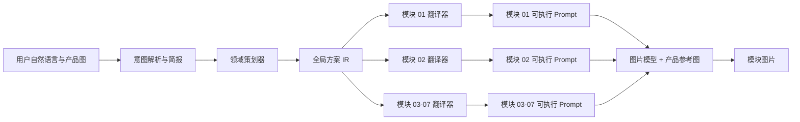

# 分阶段提示词编译方法论

> 从当前电商图“Skill”提炼出的领域生成工作流设计方法

## 0. 术语边界：这里的 Skill 是领域工作流能力包

当前项目中的“电商图 Skill”是一个借用 Skill 封装思想、为本项目定制的领域工作流能力包。

它更准确的定义是：

> **由领域规则、意图路由、状态机、固定运行时提示词、中间产物、模型选择和生成任务调度共同组成的“领域工作流能力包”。**

它借用了标准 Agent Skill 的几个重要思想：

- 把领域知识从通用系统提示词中拆出来；
- 按用户意图只加载相关能力；
- 将专业规则、示例和资源放在一个相对独立的目录中；
- 让能力可以单独修改、版本化和测试。

它与典型 Agent Skill 的主要区别是：

- 向 Agent 提供领域说明，同时由应用系统承担流程控制；
- Agent 在状态机规定的范围内完成语义判断和内容生成；
- 关键流程由应用代码中的状态机和门禁控制；
- 不同阶段加载不同的固定运行时 prompt；
- 中间结果会作为结构化业务资产保存；
- 某些阶段绑定指定模型，与全局 Agent 模型解耦；
- 最终图片任务由应用层按模块拆分和调度。

因此，本文聚焦以下问题：

> **怎样把一个高自由度、结果不稳定的生成任务，改造成一条可控、可复用、可调试的分阶段提示词编译流水线。**

本文将这套方法命名为：

## 方法命名：Staged Prompt Compilation，分阶段提示词编译法

---

## 1. 这次设计变化的本质

旧方式可以概括为：

```text
用户需求
  → 通用 Agent 自行理解
  → 通用 Agent 自行拆解
  → 通用 Agent 临场编写最终生图 prompt
  → 图片模型生成
```

新方式可以概括为：

```text
用户需求 + 产品图
  → Agent 识别意图并补齐高价值信息
  → 固定的领域策划 prompt 生成“电商图方案”
  → 固定的模块翻译 prompt 生成单模块生图 prompt
  → 单模块 prompt + 产品图交给图片模型
  → 生成模块图片
```

表面上看，新方式只是“多走了几个步骤”；实际上，它完成了四个根本性变化：

1. **把一次性自由生成，改成了多阶段受约束生成。**
2. **把领域专家知识从 Agent 的临场能力中，迁移到了固定运行时 prompt 中。**
3. **把每个阶段的输出变成下一阶段可复用、可保存、可检查的中间产物。**
4. **把 Agent 的职责从“包办全部创作”收缩为“理解意图、收集信息、选择路径和推进状态”。**

这也是图片质量提升的核心原因。

---

## 2. 为什么旧的 Agent 编排方式容易生成低质量图片

旧方式的主要瓶颈是基础模型在同一轮中承担了过多性质不同的任务。

### 2.1 单次调用承担了过多决策

通用 Agent 需要同时完成：

- 判断用户究竟想做什么；
- 理解产品及卖点；
- 判断目标平台；
- 设计整套 A+ 叙事；
- 分配七个模块的职责；
- 选择版式；
- 统一字体和颜色；
- 写营销文案；
- 处理平台合规；
- 将方案翻译为图片模型能理解的英文 prompt；
- 决定参考图和输出参数。

这些决策属于不同抽象层级。把它们压进一次生成，会产生明显的注意力竞争：模型可能理解了业务目标，却忘了版式；写对了文案，却丢失了产品身份；照顾了单张图，却破坏了七张图的一致性。

### 2.2 Agent 的自由度过高

旧链路只规定“最终要得到一个生图 prompt”，但没有严格规定模型必须经过哪些中间步骤。

这会导致同一个需求在不同轮次出现不同路径：

- 有时先想场景；
- 有时先写卖点；
- 有时先模仿风格；
- 有时直接堆叠“premium、cinematic、high-end、8K”等形容词；
- 有时为整套七张图只写一个泛化 prompt。

路径不稳定，输出质量自然不稳定。

### 2.3 领域知识只是“被提醒”，没有被强制执行

把大量专业知识放在通用系统提示词里，可以让模型“看过”这些知识。逐条落实仍然需要阶段合同和输出结构。

例如：

- 七个模块必须承担不同任务；
- 模块 03 和模块 06 不能同时使用相同卡片布局；
- 七个模块必须共用一套字体系统；
- 详情图不得编造认证、价格、排名或产品部件；
- 每张图都必须保持真实产品身份。

如果没有阶段合同和输出结构，这些规则很容易在长上下文中被弱化。

### 2.4 没有稳定的中间产物

如果策划、模块 prompt 和最终生成发生在同一轮，系统就缺少可以复用的“设计基准”。

其结果是：

- 每生成一个模块，Agent 都可能重新理解一次产品；
- 每个模块可能重新选择字体、颜色和视觉风格；
- 用户修改模块 04 时，系统可能连带重写其他模块的逻辑；
- 失败后很难判断问题出在需求理解、方案设计、prompt 翻译还是图片模型。

### 2.5 多图任务容易被错误压缩

“生成七张 A+ 图”代表七个目标不同的生成任务，每个任务都需要独立 prompt。

一个泛化 prompt 配合 `outputCount = 7`，只会得到“同一种意图的七个随机样本”。完整 A+ 套图需要从品牌 Hero 到信任收尾的七个独立模块。

### 2.6 结果过度依赖当前 Agent 基础模型

当最终 prompt 完全由用户选择的通用 Agent 模型临场编写时：

- 更换 Agent 模型会改变提示词结构；
- 模型升级可能引入新的表达偏好；
- 特定平台的商业视觉策划需要单独沉淀和优化；
- 同一模型在不同上下文长度下也可能表现波动。

换句话说，专业能力主要寄托在“某次模型发挥”中，尚未沉淀为稳定的产品系统能力。

---

## 3. 核心思想：让 Agent 沿着稳定路径工作

分阶段提示词编译法的核心是重新分配智能。

### 3.1 Agent 负责处理变化

Agent 适合负责：

- 理解自然语言；
- 识别用户意图；
- 从上下文和图片中提取产品信息；
- 找出当前最高价值的信息缺口；
- 判断应该进入哪个工作流；
- 判断用户当前是在要方案、要 prompt，还是要直接出图；
- 处理用户对已有方案的修改；
- 在信息不足时做有边界的假设。

这些工作具有开放性，需要语义理解和灵活判断，因此应该保留较高自由度。

### 3.2 固定工作流负责稳定规则

工作流适合固定：

- 阶段顺序；
- 每个阶段允许使用的输入；
- 每个阶段必须产生的输出；
- 模块分工；
- 版式候选库；
- 字体系统字段；
- prompt 的段落结构；
- 合规规则；
- 产品身份保持规则；
- 多任务拆分规则；
- 中间产物的保存和复用规则。

这些领域最佳实践应直接沉淀在工作流中。

### 3.3 图片模型负责执行“已编译”的指令

图片模型接收：

- 当前模块的明确任务；
- 已确定的版式；
- 具体的主视觉；
- 固定的字体与配色系统；
- 必须渲染的准确文案；
- 摄影和灯光要求；
- 产品参考图；
- 负面约束。

这相当于把图片模型从“参与策划”降为“执行制作”。

---

## 4. 编译器视角：这套方法到底在编译什么

这套工作流非常像一个领域编译器。



可以把各层理解为：

| 编译概念 | 电商图工作流中的对应物 |
|---|---|
| 源语言 | 用户的自然语言、简报字段、产品图片 |
| 语义分析 | Agent 对意图、产品、平台、卖点和当前阶段的判断 |
| 中间表示 IR | 电商图方案 / A+ 指导模板 |
| 专用编译器 Pass | 模块 01-07 Prompt Translator |
| 目标语言 | 图片模型可直接执行的结构化英文 prompt |
| 运行时输入 | 产品参考图、尺寸、模型和生成参数 |
| 可执行结果 | 单个 A+ 模块图片 |

用公式表达：

```text
Brief = IntentParser(UserRequest, ConversationState, ProductAssets)

PlanIR = StrategyCompiler(
  Brief,
  ProductAssets,
  DomainRules,
  LayoutLibrary,
  ComplianceRules
)

ModulePrompt[i] = ModuleCompiler[i](
  PlanIR,
  ProductAssets,
  ModuleContract[i]
)

Image[i] = ImageModel(
  ModulePrompt[i],
  ProductAssets,
  GenerationConfig
)
```

这组公式强调三个关键边界：

1. `PlanIR` 一旦生成，就成为整套图片的共同事实来源；
2. 每个 `ModuleCompiler[i]` 只处理一个模块；
3. 图片模型不再接收模糊的整套需求，只接收已经编译好的单模块指令。

---

## 5. 当前电商图工作流的四级结构

虽然核心生图链路通常被描述为“三阶段”，完整产品体验实际上包含四级。

### 5.1 阶段 0：意图识别与简报门禁

输入：

- 用户当前请求；
- 会话中的已有 brief；
- 产品图及视觉观察；
- 已保存的方案和模块 prompt。

主要动作：

- 判断是普通商品图还是 A+ 套图；
- 判断用户要的是讨论、策划、单模块 prompt 还是模块图片；
- 首次进入 A+ 工作流时弹出选填简报；
- 收集产品名称、突出卖点、目标国家和销售平台；
- 已能从上下文识别的信息作为候选项，等待用户确认。

输出：

- 当前工作流；
- 当前阶段；
- 结构化 brief；
- 待补信息；
- 下一步动作。

关键设计：

> 简报采用“最小充分输入”，以低摩擦方式补齐关键需求。

四个字段都是选填，缺失信息可以基于产品图做可调整假设，但不得编造认证、专利、临床结论、销量排名等可验证事实。

这一步负责判断需求是否已经足够进入专业流水线，并为后续策划准备可靠输入。

### 5.2 阶段 1：生成全局方案 IR

系统使用固定的 A+ 指导模板提示词，根据产品信息和产品图生成完整“电商图方案”。

这个方案同时确定：

- 产品和用户判断；
- 核心卖点及推测依据；
- 字体系统卡；
- 主色、辅色和点缀色；
- 类目视觉策略；
- 摄影类型；
- 七个模块的认知递进；
- 每个模块的职责；
- 每个模块的版式；
- 主视觉、文案、子图和 alt text；
- 七个模块的整体节奏。

该阶段输出一个接近“创意设计规范”的中间表示，供后续模块编译共同使用。

它具有两种作用：

1. **全局决策层**：先统一整套图的设计系统和叙事；
2. **事实来源层**：后续七个模块都从这里读取，不再各自发挥。

用户侧只需要看到“电商图方案已生成”和简要总结；完整方案作为内部资产保存。这样既保持产品体验简洁，也避免后续阶段失去完整信息。

### 5.3 阶段 2：将单模块方案编译为最终 prompt

每个模块都有一个对应的 Prompt Translator。

Translator 的输入是：

- 已保存的全局方案；
- 产品图；
- 用户当前对该模块的要求；
- 当前模块的固定翻译规则。

Translator 负责：

> 精确定位某一个模块，把其中的视觉、版式、字体、文案和约束翻译为图片模型可以执行的英文 prompt。

最终 prompt 采用固定段落：

```text
[Module]
[Layout]
[Hero Visual]
[Typography System]
[Text Overlay]
[Feature Cards]  // 仅特定模块和版式出现
[Style]
[Negative]
```

其中存在三类信息：

- **直接复制的信息**：字体系统、颜色、Headline、Body、标签和数据；
- **受约束翻译的信息**：主视觉、场景、镜头、灯光和构图；
- **系统注入的信息**：尺寸、版式落版规则、负面约束和产品一致性要求。

这一步完成从模块方案到图片执行指令的编译。

### 5.4 阶段 3：按模块执行图片生成

最终输入：

- 某个模块已经编译完成的 prompt；
- 真实产品图或由真实产品图生成的白底主图；
- 图片模型参数。

关键规则：

- 一个模块对应一个独立 prompt；
- 多模块生成时，一个模块对应一个独立 task；
- `outputCount` 表示同一 prompt 的抽样数量，不表示不同模块数量；
- 优先复用已保存的模块 prompt；
- 产品参考图必须绑定到生成任务；
- 默认不继承无关对话上下文，避免上下文污染。

这一步才真正调用图片模型。

---

## 6. 这套设计中最关键的十二个机制

### 6.1 先规划整套系统，再生成单张图片

A+ 的整套质量同时取决于单张图片质量和以下因素：

- 叙事是否递进；
- 卖点是否重复；
- 版式是否有节奏；
- 字体、颜色和光影是否一致；
- 场景图、信息图和细节图是否相互穿插。

因此必须先做全局方案，再做单模块生成。局部执行不能早于全局约束。

### 6.2 使用显式状态机阻止跳步

当前工作流把阶段显式标记为：

```text
brief_form
→ guidance_template
→ module_prompt
→ module_image
```

状态机的核心价值是建立门禁：

- 没有提交或跳过简报，不能直接生成方案；
- 没有方案，不能生成模块 prompt；
- 没有模块 prompt，不能直接把泛化需求交给图片模型；
- 没有产品参考图，不能生成要求保持商品身份的模块图片。

仅在 prompt 中写“请按步骤执行”是不够的。关键门禁应由应用代码控制。

### 6.3 把全局方案作为单一事实来源

字体、颜色、情绪、用户画像、核心卖点和七个模块的职责只在全局方案中决定一次。

后续模块只能读取和翻译，不能重新决定。

这条原则可以称为：

> **Single Source of Visual Truth，视觉单一事实来源。**

它直接降低跨模块漂移。

### 6.4 将中间结果保存为正式业务资产

当前系统保存两级中间产物：

```text
aPlusArtifacts.guidanceTemplate
aPlusArtifacts.modulePrompts[01..07]
```

保存中间产物带来五个好处：

- 用户下一轮不需要重新描述；
- 模块生成失败时可以直接重试；
- 修改单个模块时不影响整套方案；
- 系统可以判断工作流当前进度；
- 调试时能定位质量问题出现在哪一层。

可靠的工作流状态需要将中间结果保存为正式数据，供后续阶段直接读取。

### 6.5 每一阶段只加载与当前任务有关的 prompt

生成全局方案时加载策划模板；生成模块 03 时只加载模块 03 Translator。

这是一种运行时渐进加载：

- 减少无关规则对当前任务的干扰；
- 降低模型在多个模块之间串内容的概率；
- 让每次调用的目标更单一；
- 让不同模板可以单独版本化和优化。

### 6.6 为关键阶段建立“干净上下文”

当前运行时明确要求只使用：

- 本阶段任务输入；
- 已保存的方案；
- 附加的产品参考图。

运行时只继承上述整理后的信息，完整历史对话保留在上游意图理解层。

这解决了一个常被忽视的问题：长会话里可能存在过期需求、试验性方向、用户否定过的方案和其他图片任务。如果全部注入，专业 prompt 很容易被污染。

正确的上下文处理包含三个步骤：

1. 由 Agent 从上下文中提取有效事实；
2. 把有效事实写入 brief 或中间产物；
3. 下游阶段只消费这些经过整理的事实。

### 6.7 固定结构，开放内容

高质量固定 prompt 会固定：

- 推理顺序；
- 可选项范围；
- 必填字段；
- 输出结构；
- 继承规则；
- 禁止项；
- 冲突优先级。

产品、卖点、场景、文案和具体画面仍然由模型根据用户输入生成。

因此这套方法实现了：

> **在固定结构与边界内生成可变内容。**

### 6.8 明确“复制、翻译、推测、禁止”四类动作

稳定的 Translator 需要明确每类字段的处理方式：

| 动作 | 适用内容 | 规则 |
|---|---|---|
| 复制 | 字体系统、颜色、已确定文案 | 原样继承，不得改写 |
| 翻译 | 主视觉、场景、镜头、灯光 | 完整转为图片模型语言，不丢字段 |
| 推测 | 缺失的用户画像、一般场景 | 必须有依据，标记为可调整假设 |
| 禁止 | 认证、价格、排名、产品部件 | 没有真实依据时不得生成 |

这四类动作如果不区分，模型会把“翻译”误做成“重新创作”，把“缺失”误做成“自由补全”。

### 6.9 将抽象审美词编译为视觉参数

“高级感”“科技感”“有质感”等抽象词需要被编译为可执行的视觉参数。

固定工作流需要把它们翻译成：

- 摄影类型；
- 光线方向和软硬；
- 镜头与视角；
- 产品表面反射；
- 背景几何关系；
- 色彩范围；
- 留白位置；
- 信息层级；
- 材质微观细节；
- 道具与主体关系。

例如“科技感”应落实为冷调侧逆光、精细边缘高光、金属与玻璃反射、干净几何背景、接口或功能视觉暗示。`blue glow` 只能作为其中一个可选细节。

### 6.10 把领域约束写成硬规则和冲突优先级

不同规则发生冲突时，模型需要知道谁优先。

当前 Translator 明确规定：如果上游策划与下游硬规则冲突，版式分区、尺寸、字体系统、合规约束和文字渲染要求优先。

一个可复用的优先级可以是：

```text
真实性与安全
> 平台硬约束
> 已确认的用户事实
> 全局设计系统
> 模块职责
> 当前创意偏好
> 装饰性细节
```

没有冲突优先级，固定 prompt 越长，模型越容易面对互相矛盾的指令。

### 6.11 固定关键阶段使用的模型

当前 A+ 方案和模块 Translator 绑定指定的 Planner 模型，与用户的全局模型选择解耦。

它的意义是：

- 领域能力不再随全局 Agent 模型频繁变化；
- 可以针对模板选择最稳定的模型；
- 更容易做回归测试；
- 模型升级可以按阶段灰度，将影响范围限定在单个阶段。

这是一种“模型即运行时依赖”的管理方式。

### 6.12 多模块必须拆成多任务

七个模块共享一个全局方案，但不共享最终 prompt。

正确的数据结构是：

```text
tasks = [
  { module: "01", prompt: Prompt01, references: [...] },
  { module: "02", prompt: Prompt02, references: [...] },
  ...
  { module: "07", prompt: Prompt07, references: [...] }
]
```

需要避免的结构：

```text
prompt = "生成一整套七张 A+ 图……"
outputCount = 7
```

这一点对所有“多个目标不同的图片”都适用。

---

## 7. 自由度设计：哪里应该开放，哪里必须收紧

各阶段应按照任务的脆弱性分配不同自由度。

| 环节 | 建议自由度 | 原因 |
|---|---:|---|
| 用户意图理解 | 高 | 用户表达方式高度多样 |
| 高价值追问 | 中高 | 需要结合上下文判断缺口 |
| 产品与类目判断 | 中 | 有规则，但允许基于图片推测 |
| 全局叙事策划 | 中 | 需要创意，但必须遵守固定模块职责 |
| 版式选择 | 低到中 | 只能从经过验证的版式库中选择 |
| 字体与颜色继承 | 低 | 跨模块一致性要求高 |
| 单模块 prompt 结构 | 低 | 图片模型输入结构需要稳定 |
| 产品身份保持 | 极低 | 不允许自由发挥 |
| 合规与禁止项 | 极低 | 错误成本高 |
| 场景细节与道具 | 中 | 允许创意，但必须服务产品 |
| 图片模型抽样 | 中 | 在固定 prompt 内探索视觉结果 |

设计原则是：

> 对决定“做什么”的语义判断保留智能；对决定“不能错什么”的执行边界降低自由度。

---

## 8. 一套可复用的设计步骤

下面的方法可以用来把其他生成任务也改造成分阶段提示词流水线。

### 8.1 第一步：先定义最终产物

先回答：

- 最终要生成一个结果还是一组结果；
- 每个结果承担什么业务任务；
- 结果之间是否必须保持一致；
- 哪些错误最不可接受；
- 用户将如何确认或修改结果；
- 失败后需要从哪一步重试。

如果这些问题没有答案，直接写 prompt 只是在提前固化模糊需求。

### 8.2 第二步：列出变量、常量和禁区

把领域知识分为三类。

变量：

- 产品；
- 用户卖点；
- 目标市场；
- 场景；
- 用户画像；
- 品牌调性。

常量：

- 工作流阶段；
- 输出结构；
- 模块职责；
- 尺寸；
- 版式库；
- 字段继承规则；
- 任务拆分方式。

禁区：

- 虚假认证；
- 错误产品结构；
- 无依据数据；
- 竞品品牌；
- 价格和排名；
- 乱码和伪文字；
- 与平台目标冲突的内容。

变量交给模型，常量写入工作流，禁区同时写入 prompt 和代码校验。

### 8.3 第三步：设计最小充分 Brief

Brief 只收集会显著改变下游结果的信息。

每个字段都应通过一个测试：

> 如果缺少这个字段，生成路径或结果会不会发生实质变化？

如果不会，就不应作为前置必填项。

同时为字段定义：

- 来源：用户填写、上下文提取、图片观察或系统推测；
- 可信度：已确认、候选、推测；
- 是否阻塞；
- 后续可否覆盖；
- 是否允许为空。

### 8.4 第四步：画出状态机和门禁

为每个阶段定义：

- 进入条件；
- 必要输入；
- 执行动作；
- 输出；
- 保存内容；
- 退出条件；
- 失败处理；
- 是否允许跳过。

推荐使用以下合同：

| 阶段 | 必要输入 | 产物 | 门禁 |
|---|---|---|---|
| Intent / Brief | 用户请求 | 结构化 brief | 意图不明则不进入策划 |
| Plan | brief + 参考资产 | 全局方案 IR | 没有方案不能编译模块 |
| Compile | 方案 IR + 模块编号 | 单模块 prompt | 不得混入其他模块 |
| Execute | 单模块 prompt + 参考资产 | 图片 | 无真实参考图时不得声称身份保持 |
| Evaluate | 图片 + 模块合同 | 质量报告或重试指令 | 不通过则回到对应层修正 |

### 8.5 第五步：设计中间表示 IR

中间表示需要采用稳定、可被下游可靠读取的结构。

一个好的 IR 应满足：

- 字段固定；
- 全局信息和局部信息分离；
- 能追踪事实来源；
- 可被保存和版本化；
- 能只修改局部；
- 能验证必填字段；
- 不包含无关对话；
- 不依赖下游模型猜测段落含义。

建议至少包含：

```yaml
product:
  identity:
  category:
  audience:
  selling_points:
  assumptions:

design_system:
  typography:
  colors:
  mood:
  photography_type:

narrative:
  sequence:
  rhythm_rules:

modules:
  "01":
    objective:
    layout:
    hero_visual:
    copy:
    size:
    constraints:
```

当前工作流使用结构化 Markdown 作为 IR，已经能发挥作用；长期可进一步升级为 JSON 或 YAML，使字段校验更可靠。

### 8.6 第六步：为每类目标建立专用编译器

为不同目标建立各自的专用 Translator。

专用编译器需要明确：

- 只读取哪个模块；
- 哪些字段必须原样复制；
- 哪些字段需要翻译；
- 哪些字段不存在时应跳过；
- 最终 prompt 的固定结构；
- 当前模块允许的版式；
- 当前模块专属的约束；
- 输出只能包含什么。

如果多个 Translator 只有模块编号不同，可以保留“专用逻辑边界”，但在工程实现上使用参数化模板，减少重复和漂移。

### 8.7 第七步：隔离上下文

每个阶段只接收：

- 当前阶段的任务；
- 当前阶段真正需要的上游产物；
- 已确认的 brief；
- 必要参考资产。

每个阶段只接收经过筛选的必要上下文。

上下文的正确流动方式是：

```text
原始对话
→ 提取有效事实
→ 写入 Brief / IR
→ 下游读取 Brief / IR
```

需要避免的上下文流动方式：

```text
原始对话
→ 每一层都重新阅读和重新解释
```

### 8.8 第八步：持久化并标记产物来源

每个中间产物至少记录：

- 内容；
- 产物类型；
- 对应阶段；
- 对应模块；
- 版本；
- 生成时间；
- 来源消息；
- 使用的模板版本；
- 使用的模型；
- 绑定的参考资产。

这样才能支持：

- 复用；
- 回滚；
- 局部重做；
- A/B 测试；
- 质量追踪；
- 模型或模板升级后的差异比较。

### 8.9 第九步：将不同目标拆成独立执行任务

批量任务需要区分：

- 同一目标的多个随机样本；
- 多个不同目标各生成一张。

前者使用同一 prompt 的多次抽样；后者必须使用多个独立 prompt 和独立 task。

这是所有套图、分镜、广告系列、角色多视图和多规格物料都应遵守的原则。

### 8.10 第十步：建立逐层评估

评估应覆盖：

1. 路由是否正确；
2. 追问是否只问高价值缺口；
3. Brief 是否准确；
4. 全局方案是否完整；
5. 模块之间是否一致且不重复；
6. Translator 是否完整继承方案；
7. 最终 prompt 是否满足结构合同；
8. 图片是否保持产品身份；
9. 图片是否完成当前模块业务任务；
10. 失败是否能定位到具体阶段。

如果只评估最终图片，就无法知道该改 Agent、策划模板、Translator 还是图片模型。

---

## 9. 如何写一个高稳定性的阶段 Prompt

每个阶段 Prompt 建议包含以下部分。

### 9.1 角色和唯一任务

说明模型是谁，以及这一轮只做什么。

好的写法：

> 你负责把已确认的模块 03 策划翻译为结构化英文图片 prompt，只处理模块 03。

不够稳定的写法：

> 你是一个优秀的电商设计师，请生成高质量 A+ 图片提示词。

### 9.2 输入权威性

明确输入之间的优先级：

```text
用户已确认事实
> 产品图可观察事实
> 已保存的全局方案
> 有依据的推测
```

同时说明缺失字段怎样处理。

### 9.3 输出合同

规定：

- 段落名称；
- 段落顺序；
- 字段格式；
- 是否允许解释；
- 是否允许额外内容；
- 字数和语言；
- 可选段落出现条件。

### 9.4 继承合同

列清楚：

- 必须逐字复制的字段；
- 可以翻译但不能改义的字段；
- 可以重新生成的字段；
- 不得跨模块继承的字段。

### 9.5 领域规则

每个阶段只加载当前任务需要执行的专业规则。

### 9.6 负面约束

负面约束应聚焦真实失败模式，并控制数量和相关性。

例如：

- 不得添加产品图中不存在的结构；
- 不得生成未经提供的认证；
- 不得混入其他模块；
- 不得改变字体系统；
- 不得使用价格、折扣和排名话术；
- 不得输出乱码或伪文字。

### 9.7 冲突处理

明确当上游内容与硬约束冲突时的处理方式。否则模型会自行选择，结果不可预测。

---

## 10. 为什么这种方法通常能提升图片质量

它通过减少图片模型收到错误指令的概率，间接改善生成质量。

质量提升来自以下链条：

```text
用户意图更明确
→ 商业目标更明确
→ 全局视觉系统先统一
→ 每个模块任务更单一
→ prompt 信息结构更稳定
→ 产品参考图绑定更准确
→ 图片模型需要自行猜测的内容更少
→ 输出稳定性和一致性提高
```

可以把最终质量近似理解为：

```text
最终质量
= 意图准确度
× 领域方案质量
× Prompt 编译保真度
× 参考资产准确度
× 图片模型执行能力
```

最终质量呈乘法关系。

任意一层接近零，最终结果都会明显变差。分阶段工作流的价值，就是让每一层都可以单独优化和验证。

---

## 11. 适用范围

分阶段提示词编译法尤其适合以下任务：

- 有稳定专业流程；
- 输入表达开放，但输出结构相对稳定；
- 需要多张结果保持一致；
- 存在明确平台规范；
- 错误成本较高；
- 中间方案可以被用户确认或复用；
- 最终 prompt 经常包含大量容易遗漏的字段；
- 需要跨多轮继续工作；
- 需要支持局部修改和失败重试。

除电商 A+ 外，还可以用于：

- 品牌视觉套图；
- 广告 Campaign 多物料；
- 分镜和镜头脚本；
- 游戏角色多视图；
- 室内设计空间方案；
- 短视频脚本到镜头 prompt；
- 包装设计系列；
- 同一产品的多平台物料适配。

不一定适合：

- 完全开放的艺术探索；
- 用户只想快速生成一张概念图；
- 极简单的局部图片修改；
- 没有稳定步骤、每次路径都完全不同的任务；
- 中间方案本身没有复用价值的任务。

判断标准是：

> **任务是否存在可沉淀的稳定决策路径。**

---

## 12. 常见失败模式与反模式

### 12.1 只把一个大 prompt 拆成三个大 prompt

如果每个阶段仍然目标模糊、输入混乱、输出自由，那么增加调用次数只会增加成本，不会增加稳定性。

真正的分阶段必须有：

- 单一职责；
- 明确输入；
- 固定输出；
- 状态门禁；
- 中间产物；
- 下游继承规则。

### 12.2 每个阶段都重新理解用户

这会造成事实漂移。用户意图只应在上游整理一次，后续通过 brief 和 IR 传播。

### 12.3 把所有字段都做成用户必填

这会提升摩擦，破坏对话体验。只有会显著改变生成路径的信息才值得追问，其他字段可以使用候选值或可调整假设。

### 12.4 固定得过死

如果连场景、文案和视觉细节都固定，系统会退化成模板填空，失去针对产品的创意能力。

固定结构、边界和继承关系，同时开放场景、文案和视觉细节。

### 12.5 只在自然语言中描述状态

可靠状态需要将阶段信息和中间产物写入应用数据结构。

### 12.6 一个 prompt 承担多个不同图片目标

多个模块、多个方案、多个镜头必须拆成独立任务。否则图片模型只能随机理解哪个目标更重要。

### 12.7 重复模板缺少统一维护

当前七个模块 Translator 的主体规则高度相似，主要差异是目标模块编号。若长期复制七份完整模板，容易出现：

- 某一份单独修复，其他六份遗漏；
- 文字错误和规则漂移；
- 测试成本增加；
- 难以判断差异是业务需要还是复制遗留。

更稳的工程方式是：

```text
共享 Translator 基础模板
+ moduleId
+ moduleName
+ allowedLayouts
+ moduleSpecificRules
```

运行时再编译成模块专用 prompt。逻辑上仍然是七个专用编译器，物理文件不必重复七次。

### 12.8 只依赖 prompt 约束，不做程序校验

以下内容适合由程序验证：

- 阶段是否允许进入；
- 模块编号是否合法；
- 必要参考图是否存在；
- 七个任务是否各有独立 prompt；
- 输出段落是否齐全；
- 颜色和字体字段是否一致；
- 是否出现禁用词；
- 中间产物是否已保存。

Prompt 负责语义生成，代码负责确定性合同。

---

## 13. 当前设计的优势与可继续演进的方向

### 13.1 当前设计已经做对的部分

当前实现已经具备一条成熟领域流水线的关键骨架：

- 有 Skill / 场景召回；
- 有 A+ 专属状态机；
- 有选填简报门禁；
- 有全局策划模板；
- 有单模块 Translator；
- 有干净运行时上下文；
- 有产品图片内联；
- 有固定 Planner 模型；
- 有全局方案和模块 prompt 持久化；
- 有用户可见信息与内部资产分离；
- 有批量模块独立 task；
- 有正例、反例和行为断言。

它已经形成了“应用系统调用模型完成多个受约束编译步骤”的工作方式。

### 13.2 建议的下一阶段演进

### 方向一：把方案 IR 从 Markdown 升级为可校验结构

结构化 Markdown 便于人读，但字段仍依赖模型正确排版和下游文本定位。

可升级为：

- Planner 生成 JSON；
- 通过 Schema 校验；
- 用户侧再渲染为可读方案；
- Translator 从确定字段读取；
- 最终 prompt 仍输出自然语言。

### 方向二：参数化七个 Translator

提取共享模板，将模块编号、模块名称、允许版式和特殊规则配置化，减少重复。

### 方向三：增加阶段级 Validator

在生成方案后检查：

- 是否有七个模块；
- 字体系统字段是否完整；
- 是否存在重复卖点；
- 版式节奏是否冲突；
- 是否出现无依据声明。

在生成模块 prompt 后检查：

- 八段式结构是否正确；
- 文案是否完整继承；
- 字体和颜色是否与方案一致；
- 是否混入其他模块；
- 是否绑定产品图。

Validator 可以先用确定性代码检查结构，再用小模型检查语义。

### 方向四：增加产物版本和依赖失效机制

当用户修改全局方案时，旧模块 prompt 可能已经过期。

系统应记录：

```text
ModulePrompt.version
ModulePrompt.sourceGuidanceVersion
```

全局方案版本变化后，相关模块 prompt 应标记为 stale，并暂停复用，直至重新编译。

### 方向五：建立结果到上游阶段的定向反馈

图片失败后应先定位问题所属的阶段和类型。

需要先分类：

- 产品变形：修正产品身份与参考图约束；
- 文案乱码：减少图内文字或加强文字渲染策略；
- 版式错误：修正 Layout 编译；
- 风格漂移：检查 Typography / Style 继承；
- 卖点不清：返回全局方案或模块策划层修改；
- 多模块雷同：返回全局节奏设计层修改。

这样可以形成可控的定向修正闭环，避免模型盲目自我反思。

### 方向六：建立阶段级质量指标

建议持续记录：

- Skill / 工作流路由准确率；
- 简报一次通过率；
- 方案字段完整率；
- 模块 prompt 合同通过率；
- 跨模块字体和颜色一致率；
- 产品身份保持率；
- 虚假信息出现率；
- 单模块一次生成可用率；
- 用户回退到上游修改的比例；
- 不同模板版本和模型版本的结果差异。

---

## 14. 方法论检查清单

设计一个新的分阶段提示词工作流时，可以使用下面的清单。

### 业务层

- [ ] 最终产物和业务目标明确；
- [ ] 多个结果之间的关系明确；
- [ ] 最不可接受的错误已列出；
- [ ] 领域最佳实践可以形成相对稳定的步骤。

### 意图与 Brief

- [ ] Agent 只负责高价值语义判断；
- [ ] Brief 字段有来源和可信度；
- [ ] 非必要字段不阻塞用户；
- [ ] 推测与事实明确区分。

### 状态机

- [ ] 每个阶段有进入条件；
- [ ] 关键阶段不能被自然语言指令绕过；
- [ ] 阶段输出会被保存；
- [ ] 失败后知道回到哪一层。

### 中间产物

- [ ] 全局约束有单一事实来源；
- [ ] 全局信息和局部信息分离；
- [ ] 产物可版本化；
- [ ] 修改上游后可以判断下游是否失效。

### Prompt 编译

- [ ] 每个编译器只有一个目标；
- [ ] 复制、翻译、推测和禁止项已区分；
- [ ] 输出格式固定；
- [ ] 冲突优先级明确；
- [ ] 抽象审美词已转为具体视觉参数。

### 执行

- [ ] 不同目标拆成独立 task；
- [ ] 参考资产与任务明确绑定；
- [ ] 无关会话上下文不进入执行层；
- [ ] 模型和模板版本可追踪。

### 评估

- [ ] 路由、方案、prompt 和图片分别评估；
- [ ] 确定性合同由代码校验；
- [ ] 语义质量有 golden cases；
- [ ] 最终失败能定位到具体阶段。

---

## 15. 对这套设计最简洁的总结

这套电商图设计通过重新定义 Agent 在系统中的位置获得了更稳定的效果。

旧模式是：

> Agent 既当产品经理、策划师、设计师、Prompt 工程师，又临场决定执行流程。

新模式是：

> Agent 负责理解用户和推进流程；领域模板负责沉淀专业决策；中间产物负责保持一致；专用 Translator 负责把方案编译成可执行 prompt；图片模型负责按单模块指令出图。

因此，这套方法的核心可以归纳为一句话：

> **用 Agent 处理不确定性，用状态机管理顺序，用领域模板沉淀专家经验，用中间产物保持一致，用专用编译器生成最终 prompt，再把低歧义任务交给图片模型执行。**

---

## 附录：当前实现中的对应位置

本文方法论主要由以下现有实现提炼而来：

- 电商图领域规则与状态机说明：[`prompts/image-agent/skills/ecommerce-product-image/SKILL.md`](prompts/image-agent/skills/ecommerce-product-image/SKILL.md)
- 运行时资源、阶段和模型绑定：[`prompts/image-agent/skills/ecommerce-product-image/runtime-resources.json`](prompts/image-agent/skills/ecommerce-product-image/runtime-resources.json)
- 全局 A+ 方案生成模板：[`prompts/image-agent/skills/ecommerce-product-image/runtime-prompts/a-plus-guidance-template.prompt.md`](prompts/image-agent/skills/ecommerce-product-image/runtime-prompts/a-plus-guidance-template.prompt.md)
- 模块 Prompt Translator：[`prompts/image-agent/skills/ecommerce-product-image/runtime-prompts/`](prompts/image-agent/skills/ecommerce-product-image/runtime-prompts/)
- 工作流路由和运行时资源选择：[`src/lib/agent/skill-registry.ts`](src/lib/agent/skill-registry.ts)
- 简报门禁、干净运行时、模块任务拆分：[`src/lib/agent/planner.ts`](src/lib/agent/planner.ts)
- 中间产物持久化与复用：[`src/lib/server/message-service.ts`](src/lib/server/message-service.ts)
- 工作流正反例：[`prompts/image-agent/skills/ecommerce-product-image/examples.json`](prompts/image-agent/skills/ecommerce-product-image/examples.json)
